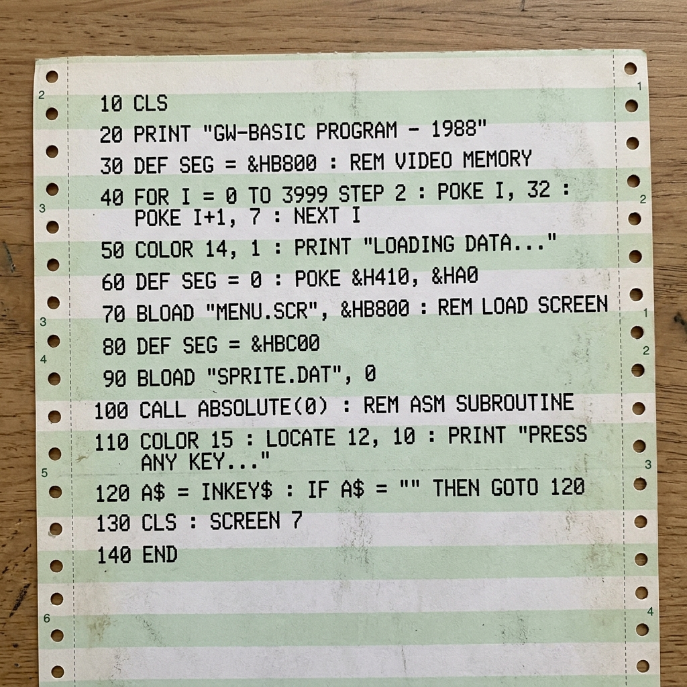

# Karel MS-DOS — Recuperacion de Software Legado en GW-BASIC

Este repositorio contiene el trabajo de recuperacion, analisis y adaptacion del entorno educativo **Karel el Robot** para MS-DOS, escrito originalmente en **GW-BASIC** en los anos 90. El proyecto forma parte de una practica de recuperacion de software legado.

---

## Punto de partida

El material de origen era un listado impreso en papel continuo de impresora matricial (papel pijama), con el codigo fuente completo del sistema Karel en GW-BASIC. Dicho listado habia sobrevivido fisicamente pero el software ya no existia en formato digital.



El proceso comenzo transcribiendo manualmente ese listado mediante OCR y correccion manual, reconstruyendo los cinco modulos que componen el sistema:

- **KAREL.BAS** — Menu principal y lanzador del entorno.
- **EDITOR.BAS** — Editor de programas Karel (lenguaje `.KAR`).
- **TRADUCT.BAS** — Traductor del lenguaje Karel a codigo de maquina interno (`.COD`).
- **MANIPUL.BAS** — Disenador grafico de mundos Karel (`.MUN`).
- **EJECUTO.BAS** — Ejecutor de programas `.COD` sobre mundos `.MUN`.

Adicionalmente se recuperaron dos binarios ensamblador que el sistema original cargaba en memoria mediante `BLOAD`:

- **SCROLL.exe** — Rutina de desplazamiento de pantalla en modo texto.
- **CUADRI.exe** — Datos graficos de la cuadricula del mundo de Karel.

Estos binarios son ficheros en formato **BSAVE de GW-BASIC**, no ejecutables PE estandar, y deben cargarse a segmentos de memoria especificos para que el interprete pueda invocarlos mediante `CALL ABSOLUTE`.

---

## Estructura del repositorio

```
ENTREGA/
  0_Originales/             Codigo transcrito del listado impreso, sin ningun parche.
    KAREL.BAS
    EDITOR.BAS
    TRADUCT.BAS
    MANIPUL.BAS
    EJECUTO.BAS

  1_Estable_SinBinarios/    Version funcional que no depende de los binarios externos.
    KAREL.BAS               Dibuja la cuadricula internamente con codigo BASIC puro.
    EDITOR.BAS
    TRADUCT.BAS
    MANIPUL.BAS
    EJECUTO.BAS

  2_Experimental_ConBinarios/  Version experimental que recupera el uso de los binarios.
    KAREL.BAS               Carga SCROLL.exe y CUADRI.exe en RAM convencional (&H9000).
    EDITOR.BAS
    TRADUCT.BAS
    MANIPUL.BAS
    EJECUTO.BAS
    SCROLL.exe
    CUADRI.exe

  Documentacion/
    MEMORIA_KAREL_PABLO_MARTA.pdf   Memoria tecnica del proyecto.

  Programas_Prueba/         Programas .KAR y mundos .MUN de ejemplo para pruebas.

  gwbasic.exe               Interprete GW-BASIC necesario para ejecutar el sistema.

docs/
  papel_pijama_continuo.png   Foto del listado original impreso en papel continuo.
```

---

## Las tres versiones

### Version 0 — Originales (transcripcion del papel)

Codigo recuperado directamente del listado impreso mediante OCR y correccion manual. Contiene las referencias a unidades de disco (`A:`, `B:`) y a segmentos de memoria de video propios del hardware original donde fue desarrollado. No es ejecutable directamente en DOSBox sin un entorno de disco identico al original.

### Version 1 — Estable sin binarios

Primera version completamente funcional. Se eliminaron las referencias a unidades de disco concretas, haciendo que todos los ficheros se lean y escriban en el directorio de trabajo actual. La rutina de dibujado de la cuadricula (que en el original dependia de `CUADRI.exe` cargado en la pagina 1 de la VRAM) fue reescrita en GW-BASIC puro usando caracteres de linea de la tabla ASCII extendida. Esta version se puede ejecutar directamente en DOSBox montando la carpeta como unidad C:.

**Como ejecutar:**
```dos
mount c C:\ruta\a\1_Estable_SinBinarios
c:
gwbasic KAREL.BAS
```

### Version 2 — Experimental con binarios

Version que intenta restaurar el comportamiento original usando los binarios recuperados. El problema principal es que en el hardware original los binarios se cargaban en la **memoria de video** (segmentos `&HBA00` y `&HB800`), pero los emuladores modernos (DOSBox) no permiten ejecutar codigo desde esas direcciones de forma fiable.

La solucion investigada fue reubicar `SCROLL.exe` al segmento de RAM convencional segura `&H9000` y ajustar todos los `CALL ABSOLUTE` en consecuencia. El resultado es que el menu arranca correctamente y la cuadricula del mundo se renderiza usando la rutina ensamblador original, aunque en DOSBox el comportamiento puede variar segun la version del emulador y la configuracion de memoria.

**Estado actual:** parcialmente funcional. El menu y el editor operan con normalidad. El modulo de diseno de mundos y el ejecutor presentan un cuelgue al intentar la primera llamada a la rutina de desplazamiento, probablemente por diferencias en el mapeo de la memoria de video entre el hardware original (CGA/EGA de los anos 90) y la emulacion de DOSBox.

---

## Analisis tecnico de los binarios

Los dos binarios recuperados son ficheros **BSAVE de GW-BASIC** (cabecera `FD` seguida de segmento, offset y longitud codificados en little-endian):

| Fichero    | Segmento original | Offset | Tamano | Proposito                                      |
|------------|-------------------|--------|--------|------------------------------------------------|
| SCROLL.exe | `&HBA00`          | `0x00` | 454 B  | Rutina de scroll de pantalla en modo texto     |
| CUADRI.exe | `&HB800`          | `0x1000` | 3370 B | Datos graficos de la cuadricula del mundo    |

La rutina de `SCROLL.exe` implementa una copia de bloque de memoria de video usando instrucciones `REP MOVSW` en modo real de 16 bits. Su punto de entrada esta en el offset `0xAD` dentro del fichero (primer byte ejecutable tras la cabecera BSAVE).

---

## Requisitos para ejecutar

- **DOSBox** (cualquier version >= 0.74) o hardware real con MS-DOS 3.x o superior.
- **GW-BASIC 3.23** (incluido como `gwbasic.exe` en la raiz del repositorio).
- No se requiere ninguna libreria ni dependencia adicional.

---

## Contexto historico

Karel el Robot es un lenguaje de programacion educativo disenado para ensenanza de programacion estructurada, creado originalmente por Richard Pattis en la Universidad de Stanford en 1981. Esta implementacion en GW-BASIC para MS-DOS fue utilizada en ensenanza universitaria en Espana durante la decada de los 90 y constituye un ejemplo representativo del software educativo de la epoca que, sin esfuerzos de recuperacion activos, habria quedado perdido definitivamente.

---

## Autores

Pablo Villa — recuperacion, analisis, depuracion y documentacion.  
Marta — colaboracion en transcripcion y redaccion de la memoria.
